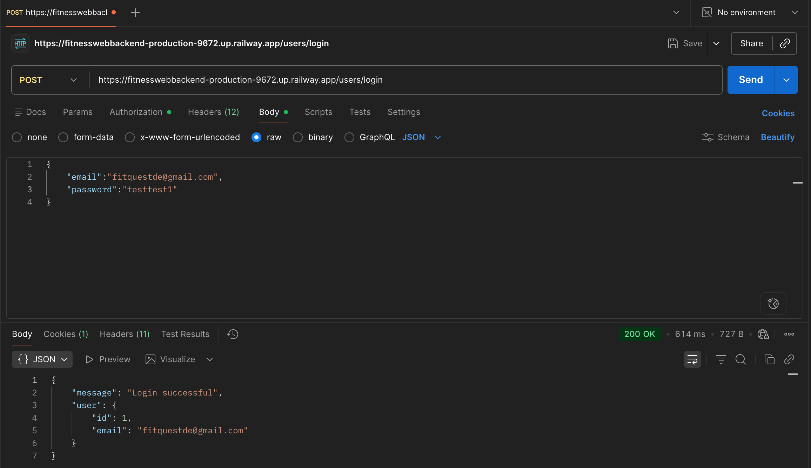
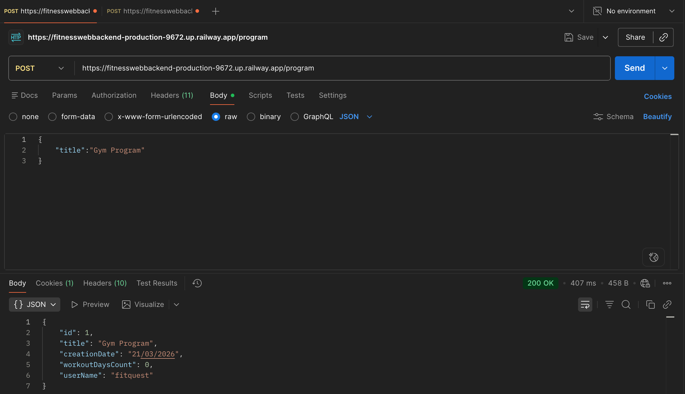
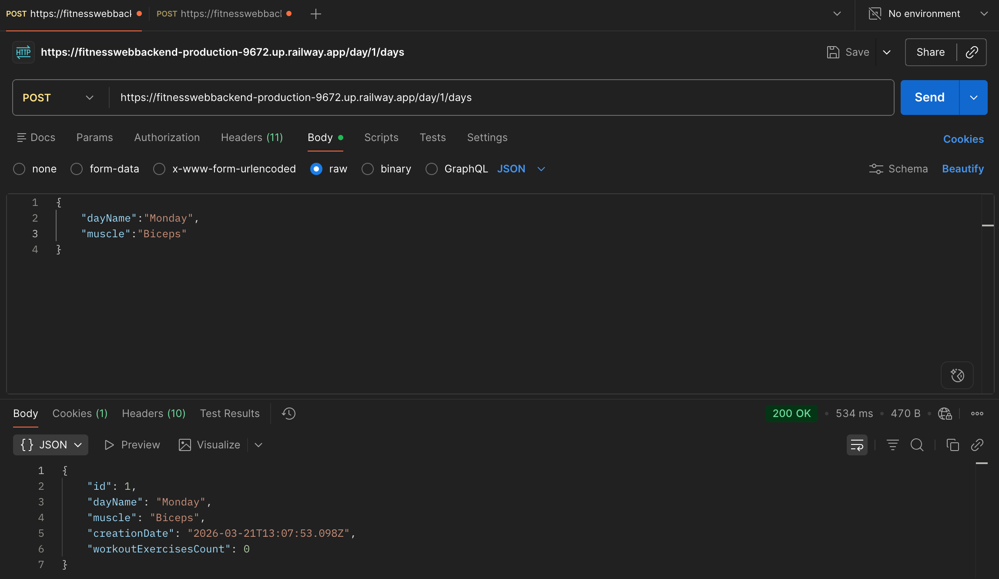
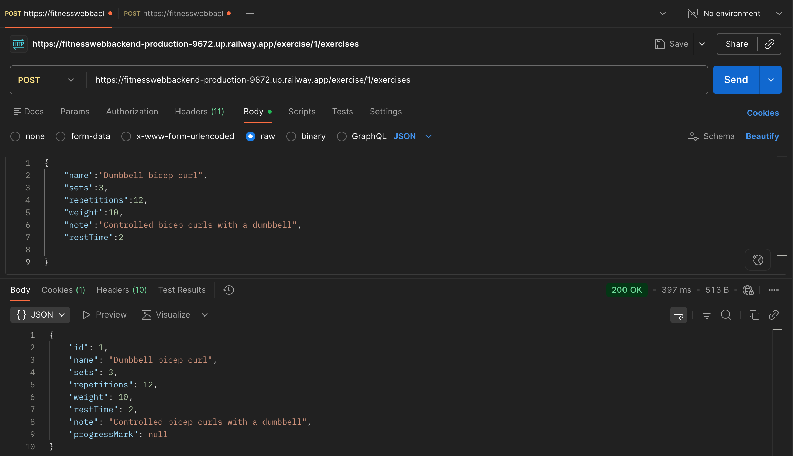
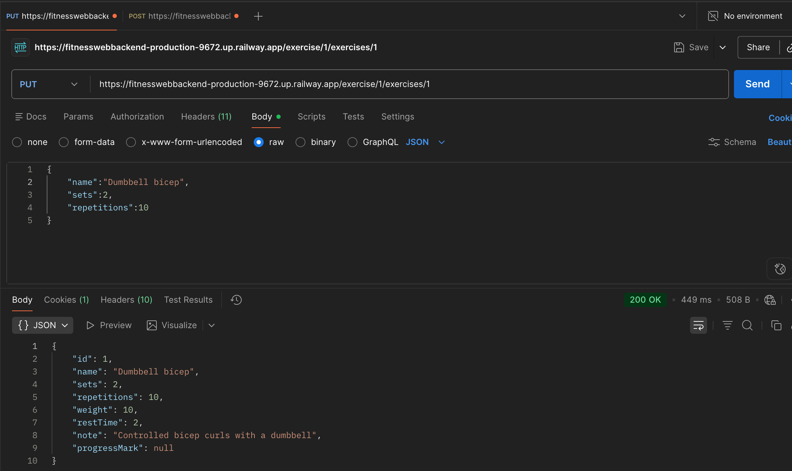

# FitQuest_backend

**Demo:** [fitquest.fit](https://fitquest.fit/)  
**Frontend Repository:** [FitQuest Frontend](https://github.com/slava-oliinyk-dev/FitQuest_Frontend)  
**Backend API:** [fitnesswebbackend-production-9672.up.railway.app](https://fitnesswebbackend-production-9672.up.railway.app/)  
**API Examples:** See the [API Examples](#api-examples) section below.

## Project Overview

FitQuest_backend is a TypeScript and Express API for a workout planning app. It supports user registration, email confirmation, JWT-based authentication, Firebase login, and CRUD operations for workout programs, workout days, and exercises. It also includes a contact flow that sends consultation requests to Telegram.

This project is a good example of a modular backend application with clear separation between controllers, services, and repositories. It uses Prisma with PostgreSQL for data persistence, Passport JWT for protected routes, and DTO validation to make request handling safer and more predictable.

## Why I Built This Project

I built this project to practice creating a backend application that feels closer to a real product than a simple CRUD project. I wanted to work not only with database operations, but also with authentication, email confirmation, third-party integrations, and a cleaner project architecture. It was also a way for me to improve my TypeScript, Express, Prisma, and backend design skills through a practical use case.

## Features

### User Authentication

- Register with email and password
- Log in and log out with JWT-based authentication
- Get the current authenticated user profile

### Email Confirmation Flow

- Send a confirmation email after registration
- Confirm email with a code-based link
- Resend confirmation emails when needed

### Firebase / Google Sign-In

- Verify Firebase ID tokens
- Auto-create a user account for first-time sign-ins
- Support a redirect-based Firebase authentication flow

### Workout Program Management

- Create, view, update, and delete workout programs for the authenticated user

### Workout Day Management

- Organize workout days inside each program
- Store the day name, muscle group, and exercise count

### Exercise Management

- Create, view, update, and delete exercises inside a workout day
- Track sets, repetitions, weight, rest time, notes, and progress marks
- Update exercise notes separately

### Consultation Requests

- Accept consultation form data and forward it to Telegram

### Health Check

- Provide a simple `/health` endpoint for availability checks

## Tech Stack

- **Language:** TypeScript
- **Backend Framework:** Express
- **Dependency Injection:** Inversify
- **Database:** PostgreSQL
- **ORM:** Prisma
- **Authentication:** Passport JWT, jsonwebtoken, bcryptjs, Firebase Admin
- **Validation:** class-validator, class-transformer
- **Email:** Nodemailer or Resend via a shared mail adapter
- **Messaging Integration:** Telegram Bot API with Axios
- **Testing:** Jest
- **Dev Tools:** Nodemon, ts-node, ESLint, Prettier

## Architecture / Project Structure

```txt
src/
  app.ts                 # Express app setup
  main.ts                # Dependency injection bootstrap
  common/                # Shared controller and middleware helpers
  config/                # Config service and Passport setup
  database/              # Prisma client wrapper
  errors/                # HTTP error and global exception filter
  log/                   # Logger service
  modules/
    users/               # Auth, users, email confirmation, Firebase login
    programs/            # Workout program CRUD
    days/                # Workout day CRUD
    exercises/           # Exercise CRUD
    telegram/            # Telegram consultation flow
  utils/
    mailer.ts            # SMTP / Resend mail adapter

prisma/
  schema.prisma          # Database schema
  migrations/            # Prisma migrations
```

The application follows a layered structure:

- **Controllers** handle routes and HTTP responses
- **Services** contain business logic
- **Repositories** interact with Prisma and the database
- **DTOs** validate incoming request data

## API Overview

### Base Routes

- `/users`
- `/program`
- `/day`
- `/exercise`
- `/telegram`
- `/health`

### Main Endpoints

#### Users

- `POST /users/register`
- `POST /users/login`
- `POST /users/logout`
- `GET /users/me`
- `POST /users/re-email`
- `GET /users/confirm-email/:code`
- `POST /users/firebase`
- `GET /users/firebase-redirect`

#### Programs

- `GET /program`
- `POST /program`
- `GET /program/:programId`
- `PUT /program/:programId`
- `DELETE /program/:programId`

#### Days

- `GET /day/:programId/days`
- `POST /day/:programId/days`
- `GET /day/:programId/days/:dayId`
- `PUT /day/:programId/days/:dayId`
- `DELETE /day/:programId/days/:dayId`

#### Exercises

- `GET /exercise/:dayId/exercises`
- `POST /exercise/:dayId/exercises`
- `GET /exercise/:dayId/exercises/:exerciseId`
- `PUT /exercise/:dayId/exercises/:exerciseId`
- `PUT /exercise/:dayId/exercises/:exerciseId/note`
- `DELETE /exercise/:dayId/exercises/:exerciseId`

#### Telegram

- `POST /telegram/consultation`

## Getting Started

### Prerequisites

- Node.js and npm
- PostgreSQL database
- Firebase service account credentials
- Email provider credentials for registration emails
- Telegram bot credentials for consultation requests

### Installation

```bash
npm install
```

### Database Setup

Generate the Prisma client and run migrations:

```bash
npm run generate
npm run migrate:dev
```

### Run in Development

```bash
npm run dev
```

### Build for Production

```bash
npm run build
npm start
```

## Environment Variables

Create a `.env` file in the project root.

### Core Variables

```env
DATABASE_URL=
PORT=
CORS_ALLOWED_ORIGINS=
SECRET=
SALT=
FIREBASE_SERVICE_ACCOUNT=
CONFIRMATION_BASE_URL=
FRONTEND_LOGIN_URL=
```

### Telegram

```env
TELEGRAM_BOT_TOKEN=
TELEGRAM_CHAT_ID=
```

### Email

```env
MAIL_PROVIDER=
MAIL_FROM=
RESEND_API_KEY=
MAIL_USER=
MAIL_PASSWORD=
MAIL_SERVICE=
MAIL_HOST=
MAIL_PORT=
MAIL_SECURE=
MAIL_HTTP_TIMEOUT_MS=
MAIL_CONNECTION_TIMEOUT_MS=
MAIL_GREETING_TIMEOUT_MS=
MAIL_SOCKET_TIMEOUT_MS=
```

These variables are used for Prisma, JWT authentication, Firebase initialization, email delivery, and Telegram messaging.

## Available Scripts

```bash
npm start
npm run dev
npm run dev:inspect
npm run generate
npm run build
npm test
npm run lint
npm run lint:fix
npm run format
npm run format:write
npm run migrate:dev
npm run migrate:prod
```

## Known Limitations

- There is no deployment or CI/CD configuration in the repository
- Tests currently focus mostly on service logic; controller and integration tests are still missing
- Some user-management routes are protected with a role check that may need refinement depending on final product requirements
- The generic email-related flow should be reviewed carefully before public deployment

## Future Improvements

- Add controller and integration tests
- Add API documentation with example requests and responses
- Add CI/CD and deployment configuration
- Improve role-based access control
- Add request rate limiting and more production-oriented security hardening

## What I Learned

Through this project, I improved my understanding of how to structure a backend application in a more scalable way. I practiced separating responsibilities between controllers, services, and repositories, which made the code easier to maintain and reason about.

I also gained more hands-on experience with Prisma and PostgreSQL, especially when working with related entities such as programs, workout days, and exercises. Building the authentication flow helped me better understand JWT, password hashing, protected routes, and user account confirmation. Integrating Firebase login, email sending, and Telegram messaging also showed me how backend applications often need to work with several third-party services at the same time.

Overall, this project helped me feel more confident building a backend that is closer to a real product than a simple training CRUD application.

## API Examples

### Login



### Create Program



### Create Day



### Create Exercise



### Change Exercise


